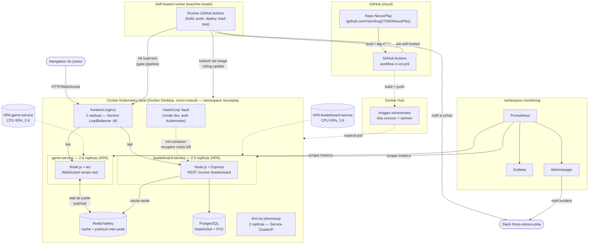

# NexusPlay — Schema d'architecture

## Vue d'ensemble

## Flux principaux

1. **Trafic joueur** : navigateur -> Service `frontend` (LoadBalancer, mappe sur `localhost` par
   Docker Desktop) -> nginx route `/ws` vers `game-service` et `/api` vers `leaderboard-service`.
2. **Etat de jeu partage entre pods** : `game-service` est stateless au niveau process ; l'etat de
   chaque partie vit dans Redis (hash + pub/sub), ce qui permet a 2 joueurs connectes a 2 pods
   differents de bien se rencontrer et a `game-service` de scaler horizontalement sans bug.
3. **Cache-aside** : `leaderboard-service` sert `/leaderboard/top` depuis Redis (TTL 30s) et
   retombe sur PostgreSQL en cas de cache miss, invalide le cache a chaque nouveau score.
4. **Secrets** : `leaderboard-service` recupere ses identifiants PostgreSQL depuis Vault via un
   init-container (auth Kubernetes), pas de mot de passe en dur ni de Secret k8s statique cote
   application.
5. **Autoscaling** : HPA CPU 60% sur `game-service` et `leaderboard-service` (2 a 6 replicas) ;
   demontre en pratique sous test de charge k6 (scale-out 3 -> 6 sur `leaderboard-service`).
6. **Monitoring** : Prometheus scrape les metriques applicatives (`prom-client`) et les metriques
   cluster (kube-state-metrics), Grafana affiche pods/HPA/latence, Alertmanager notifie Slack.
7. **CI/CD** : push sur `main` -> GitHub Actions (runner self-hosted, sur la meme machine que le
   cluster) -> build+push Docker Hub -> rolling update Kubernetes -> test de charge k6 (gate) ->
   notification Slack uniquement en cas d'echec.
8. **DNS HA** : 2 replicas dnsmasq derriere un Service Kubernetes (redondance niveau Service,
   VRRP non pertinent sur un cluster mono-noeud — voir `k8s/base/dns-ha/README.md`).

## Notes de lecture

- Les fleches en pointilles (`-.->`) representent des flux indirects/asynchrones (build d'image,
  scaling pilote par metriques, injection de secrets au demarrage).
- Ce diagramme est au format [Mermaid](https://mermaid.js.org/), rendu nativement par GitHub dans ce
  fichier — pas besoin d'outil externe pour le visualiser.
